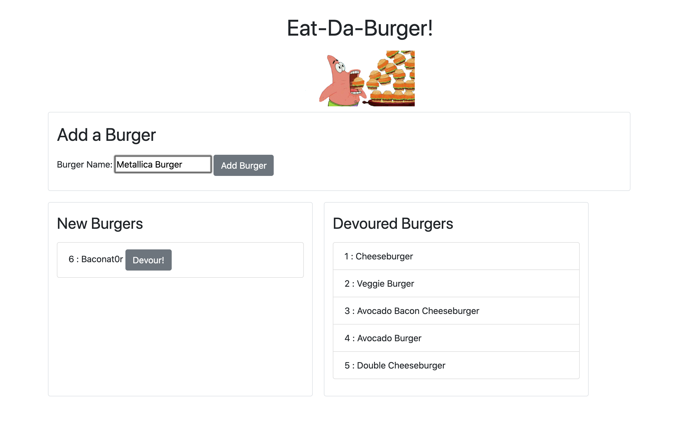
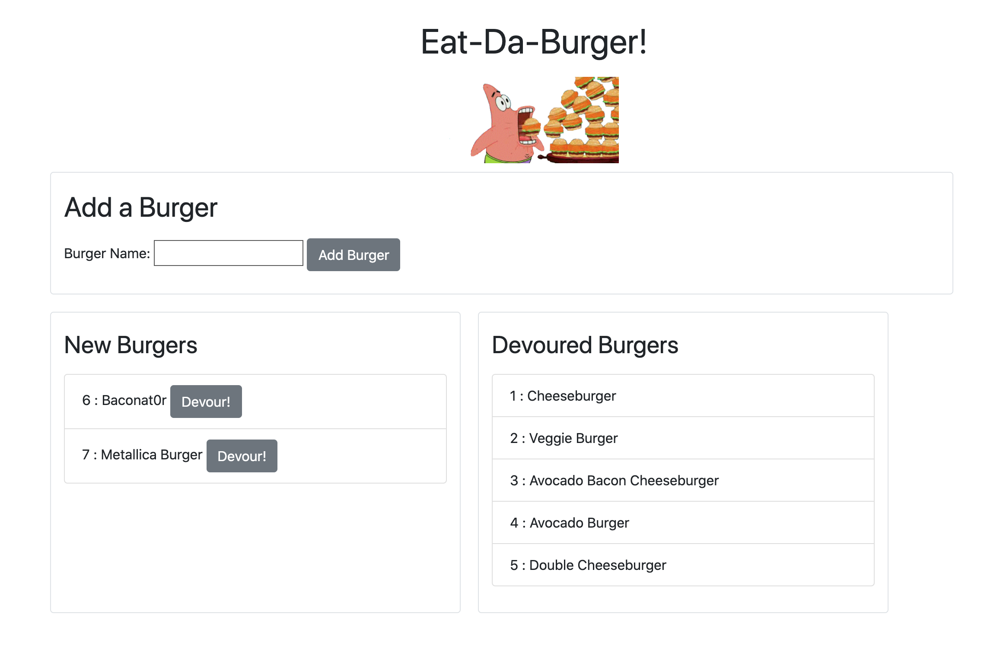
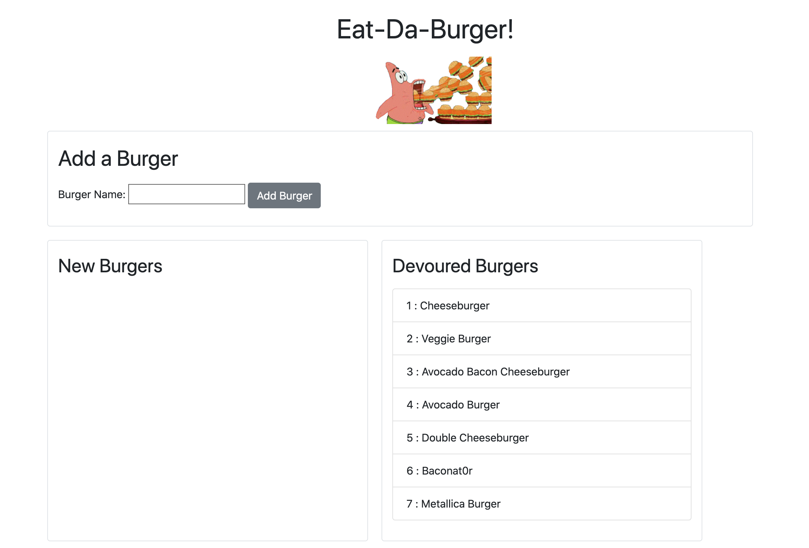

# Eat-Da-Burger

## Description

Keep track of all the different kinds of burgers you'd like to eat with Eat-Da-Burger! Store the names of the burgers you would like to eat, then, once you've devoured them, you can save the name so you can see all the burgers you've had.

### Table of Contents

[Installation](#installation) | 
[Usage](#usage) | 
[License](#license) | 
[Questions](#questions) | 

### Installation

Packages include Express, Express-Handlebars, and MySQL.

### Usage

You can create your own burger in the Add a Burger section and save it in your New Burgers section for later. Once you've devoured your burger, save it in the devoured burgers section!

### License

### Questions

### cjpalmerin@gmail.com

